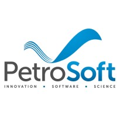

# Hi there, I'm Emanuel Xavier!

Welcome to my GitHub profile. I'm a passionate DevOps and Software Engineer with a strong background in backend development and cloud infrastructure. I'm dedicated to creating efficient and reliable software solutions through automation, continuous integration, and thoughtful system design.

## About Me
- 🌍 Based in Brazil.
- 🎓 Graduated with a Bachelor's degree in Computer Science from the Federal University of Ouro Preto.
- 💼 I have experience working as a Backend Developer, SRE, DevOps Engineer, and Frontend Developer.
- 🛠️ I'm proficient in C++, Python, and JavaScript, with a focus on Node.js for backend development.
- ☁️ Skilled in building and maintaining cloud infrastructure using AWS, GCP, and Docker.
- 🔧 I'm a problem solver at heart, with expertise in Linux server administration and troubleshooting.

## Work Experience

&nbsp;&nbsp;**Backend Developer** \
&nbsp;&nbsp;[**TerraLAB**](http://www2.decom.ufop.br/terralab/) • Trainee/Internship \
&nbsp;&nbsp;• Mar 2020 - Nov 2021 \
&nbsp;&nbsp;Languages & Technologies: `JavaScript`, `Node.js`, `Firebase`, `Jest`, `GitLab`, `GitLab CI`, `AWS` \
Featured Projects: 
- [Segurança da Mulher ](https://play.google.com/store/apps/details?id=com.ouvidoria.mobile&hl=pt_BR&gl=US)
A collaborative mobile application aimed at providing a safe platform for women to report incidents anonymously. This project showcases my skills in Node.js, JavaScript, Docker, AWS, GCP, and more.
 

&nbsp;&nbsp;**SRE and DevOps** \
&nbsp;&nbsp;[**TerraLAB**](http://www2.decom.ufop.br/terralab/) • Trainee/Internship \
&nbsp;&nbsp;• Nov 2021 - Nov 2022 \
&nbsp;&nbsp;Languages & Technologies: `AWS`, `GCP`, `Linux`, `Docker`, `GitLab`, `GitLab CI`, `Terraform`, `Ansible` \
Featured Projects:
- [Terraplanner ](https://terraplanner.org/)
An exciting map-based project designed to generate routes and geographical tools, with data visualization from various locations across Brazil. I've utilized Docker, Terraform, Ansible, GitLab CI/CD, AWS, and GCP to make this project a reality.
 

&nbsp;&nbsp;**Frontend Developer** \
&nbsp;&nbsp;[PetroSoft](http://www.petrolsoftdesign.com/) \
&nbsp;&nbsp;• Nov 2022 - Dec 2022 \
&nbsp;&nbsp;Languages & Technologies: `JavaScript`, `CSS`, `HTML`, `Liferay` \
As a frontend developer, I worked on developing user interfaces using vanilla JavaScript, CSS, and HTML inside Liferay, a Java-based portal framework. I collaborated with designers, backend developers, and other team members to develop and maintain high-quality user interfaces for web-based applications.
 

&nbsp;&nbsp;**DevOps Professional** \
&nbsp;&nbsp;[PetroSoft](http://www.petrolsoftdesign.com/) \
&nbsp;&nbsp;• Jan 2023 - Present \
&nbsp;&nbsp;Languages & Technologies: `Linux`, `Docker`, `Jenkins` \
As a DevOps professional, I specialize in ensuring efficient and reliable software delivery by automating deployment and configuration tasks, ensuring systems availability and scalability, and collaborating closely with development teams to resolve issues and deliver solutions quickly and efficiently. I have expertise in Linux server administration, troubleshooting, and using Jenkins to manage build, test, and deployment pipelines for continuous integration and delivery of software products.

## Let's Connect
I'm enthusiastic about collaboration and continuous learning. You can connect with me through various channels:

- [ emanueljx@outlook.com](mailto:emanueljx@outlook.com)
- [ Emanuel Xavier](https://www.linkedin.com/in/emanuel-xavier)
-  emanuel.x

Looking forward to connecting with fellow
